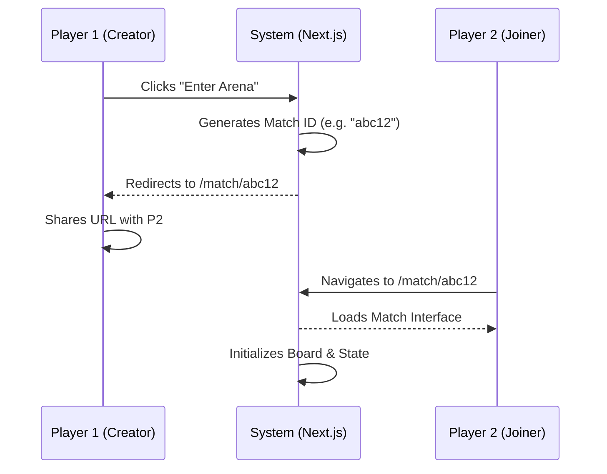
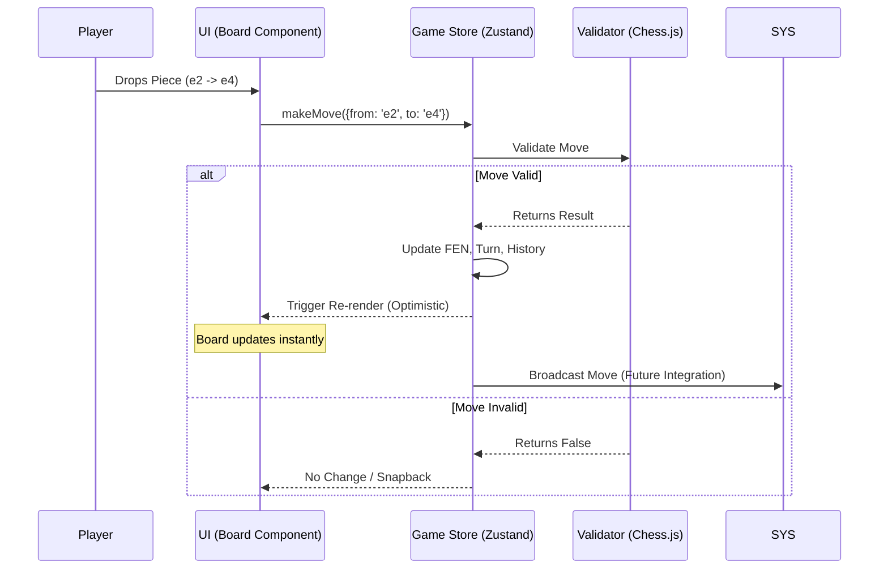
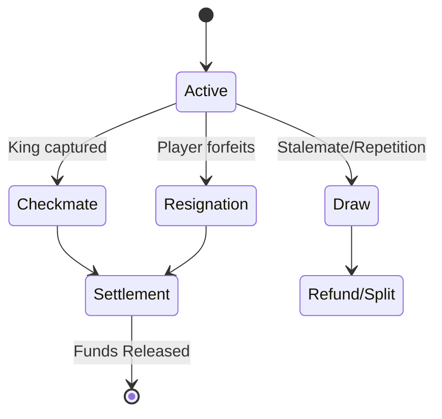

# User Flows

## 1. Game Creation & Joining (MVP)
This flow describes how a user starts a match in the MVP version (no lobby, direct link).

## 2. Move Execution (Optimistic UI)
This flow details the optimistic update strategy to ensure lag-free experience.

## 3. Game Settlement (Planned)
How the game concludes and funds are settled.

